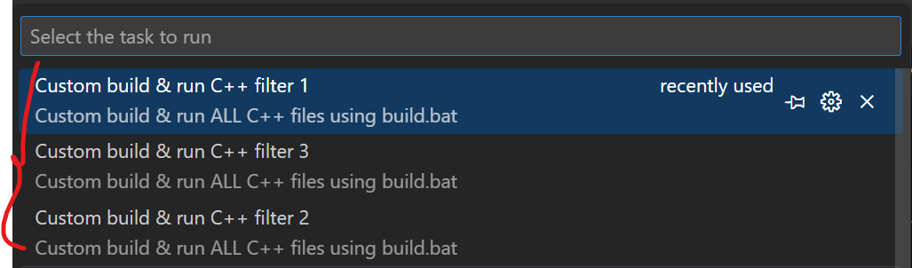

<!-- omit in toc -->
# Refactor-Filter Example

<!-- omit in toc -->
## Blog
[C++, Implement filter function for refactoring to keep code dry, clean and flexible](https://ivanyu2021.hashnode.dev/c-implement-filter-function-for-refactoring-to-keep-code-dry-clean-and-flexible)


<!-- omit in toc -->
## Content
- [Requirements](#requirements)
- [Run](#run)
- [Output](#output)
  - [](#)


## Requirements
- g++ (using C++ 17), (https://code.visualstudio.com/docs/cpp/config-ming)
- Visual Studio Code

## Run
- `Ctrl + Shift + T` and then select the following task to run


  Reference: [tasks.json](https://github.com/ivanyu199012/13-Refactor-FilterFunctions/blob/main/.vscode/tasks.json)

## Output

###
Task: Custom build & run C++ filter 1
```
----------------------------
People larger than 18:
John, Age: 34
Peter, Age: 54
Wong Yin, Age: 32
Xiu Ming, Age: 52
Mr. Pak, Age: 32
Gilbin, Age: 52
```

Task: Custom build & run C++ filter 2 / 3
```
----------------------------
People larger than 18:
John, Age: 34
Peter, Age: 54
Wong Yin, Age: 32
Xiu Ming, Age: 52
Mr. Pak, Age: 32
Gilbin, Age: 52
----------------------------
People has income greather than 15000:
Peter, Income: 20000
Xiu Ming, Income: 20000
Gilbin, Income: 20000
----------------------------
```